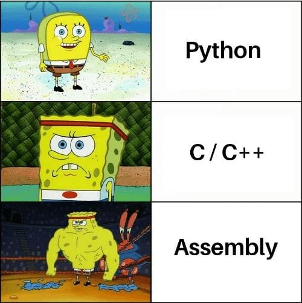

# libasm
  
Post-CommonCore project of the 42 school.

# Description
This project is an introduction to assembly language (ASM).  
The goal is to make library in 64 bits ASM named `libasm.a`.  
Inline ASM is forbidden, we must use `.s` files.  
Compilation must be done with `nasm`.  
Intel syntax must be used, not the AT&T one.

The library must contain the following functions:
- ft_strlen (man 3 strlen)
- ft_strcpy (man 3 strcpy)
- ft_strcmp (man 3 strcmp)
- ft_write (man 2 write)
- ft_read (man 2 read)
- ft_strdup (man 3 strdup, malloc allowed)
- ft_atoi_base
- ft_list_push_front
- ft_list_size
- ft_list_sort
- ft_list_remove_if

For each syscall, errors must be checked and the value of `errno` must be setted accordingly.  
Therefore, calling the `extern ___error` or `errno_location` is allowed.

The linked list functions must use the following structure:
```c
typedef struct s_list	t_list;

t_list
{
	void	*data;
	t_list	*next;
};
```